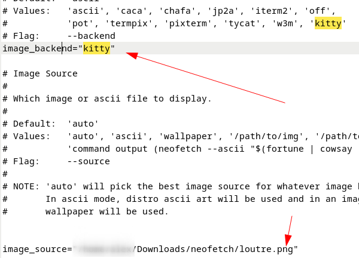
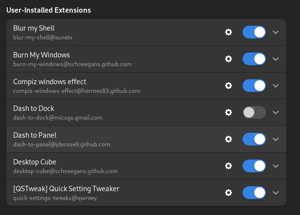

# 🍛 Ricing - pentest

Il s'agit d'un processus de personnalisation de l'apparence de l'interface utilisateur de son environnement de bureau ou de son gestionnaire de fenêtres.

## 🎯 Objectifs

Construire une VM ergonomique et utile pour le pentest.

## 📋 Prérequis

debian 12 - gnome&#x20;

> **ℹ️ Note:** Vous pouvez utiliser d'autres UNIX :
> - 👍 **Arch** : extrêmement personnalisable
> - 👎 **Arch** : compliqué

## 📸 Avant&#x20;


## 📸 Après&#x20;

<p align="center">
  
</p>


***

## 🛠️ Outils de Pentest

### [Exegol ](https://exegol.readthedocs.io/en/latest/getting-started/install.html#installation)

Exegol est un environnement de piratage communautaire, puissant et pourtant suffisamment simple pour être utilisé par n'importe qui dans ses engagements quotidiens

### [Arsenal ](https://www.it-connect.fr/linux-inventaire-commandes-favorites-outil-arsenal/)

Permet de retrouver mes commandes et outils

***

## 💻 &#x20;Terminal&#x20;

### Zsh et Oh My Zsh

Utiliser Zsh avec Oh My Zsh et Kitty est bénéfique car Zsh offre une syntaxe avancée et des fonctionnalités étendues par rapport à Bash, Oh My Zsh simplifie la personnalisation avec des thèmes et des plugins.&#x20;

1.  **Installation de Zsh** :

    ```bash
    sudo apt update
    sudo apt install zsh
    ```
2.  **Définir Zsh comme Shell par Défaut** :

    ```bash
    chsh -s $(which zsh)
    ```
3.  **Installation de Oh My Zsh** :

    ```bash
    sh -c "$(curl -fsSL https://raw.githubusercontent.com/ohmyzsh/ohmyzsh/master/tools/install.sh)"
    ```
4. **Personnalisation de Zsh (optionnel)** :
   * Modifier le [**thème**](https://github.com/ohmyzsh/ohmyzsh/wiki/Themes) dans `~/.zshrc` en changeant la ligne `ZSH_THEME`.
   * Ajouter des [**plugins**](https://github.com/ohmyzsh/ohmyzsh/wiki/Plugins) dans `~/.zshrc` dans la variable `plugins`.
5.  **Recharger la Configuration de Zsh** :

    ```bash
    source ~/.zshrc
    ```

> J'ai choisi le thème : **alanpeabody**
>
> Petite mention pour **jnrowe** qui est pas mal aussi !

### Kitty 🐱 :&#x20;

Kitty est un terminal moderne avec gestion avancée des onglets et du tiling, améliorant ainsi l'efficacité et l'expérience utilisateur dans la gestion des tâches et du développement.

```bash
# Installer Kitty
sudo apt update
sudo apt install kitty

# Définir Kitty comme terminal par défaut
sudo update-alternatives --config x-terminal-emulator

Sinon installer l'application.
```

Vous pouvez configurer les marges en les terminal , les couleurs, les raccourcis&#x20;

* Modifier fichier conf : `gedit ~/.config/kitty/kitty.conf`


> [**Guide de configuration kitty** ](https://linuxiac.com/kitty-terminal-emulator/)&#x20;

### [📂 Voir mon fichier de conf](Configs/kitty.conf) (kitty.conf)&#x20;

***

### Neofetch 🖥️

Affiche des informations détaillées sur votre système d'exploitation, notamment le logo ou l'art ASCII de la distribution Linux, la version du noyau, du processeur, de la mémoire, de la résolution d'écran, du gestionnaire de fenêtres, etc.

Idée de thème:&#x20;

- [Neofetch Themes Repository](https://github.com/mmsaeed509/neofetch-themes/)

Pour mettre une image et non un ascii ART, j'ai mofifié ces lignes :&#x20;



A modifier dans :&#x20;

`gedit ~/.config/neofetch/config.conf`

### [📂 Voir mon fichier de conf](Configs/neofetch.conf) (neofetch.conf) :&#x20;


Le lancer a l'ouverture du terminal :&#x20;

* <pre class="language-sh"><code class="lang-sh"><strong>nano ~/.zshrc
  </strong></code></pre>
*   Ajoutez la commande `neofetch` à la fin du fichier :

    ```sh
    # Run neofetch at the start of the terminal
    neofetch
    ```
* Sauvegardez le fichier et fermez l'éditeur (dans Nano, appuyez sur `Ctrl+O` pour sauvegarder, puis `Ctrl+X` pour quitter).
*   Rechargez le fichier de configuration pour appliquer les changements sans redémarrer le terminal :

    ```sh
    source ~/.zshrc
    ```

## Fond d'ecran&#x20;

### Je vous recommande ces sites pour des fonds d'écran 4k :

- [UHDPaper](https://www.uhdpaper.com/)
- [Minimalistic Wallpaper](https://minimalistic-wallpaper.demolab.com/)
- [Alpha Coders](https://alphacoders.com/)
- [Wallhaven](https://wallhaven.cc/)

J'ai choisi celui-ci :&#x20;


## 🧱 Extensions&#x20;

Choisir diffrentes thèmes et extensions : 
- [GNOME Look](https://www.gnome-look.org)

Télécharger le thème, l'extraire et le mettre dans `~/.local/share/icons/`. Aller dans Tweaks > Apparence et choisissez le thème.

Quelques thèmes sympa ! 
* [Thème Cyberpunk Technotronic](https://github.com/dreifacherspass/cyberpunk-technotronic-icon-theme/tree/main)
* [Thème Reversal](https://github.com/yeyushengfan258/Reversal-icon-theme)
* [Icônes Papirus](https://github.com/PapirusDevelopmentTeam/papirus-icon-theme)

J'ai choisi ces extensions :&#x20;



* **Blur my shell** : Pour flouter l'arrière-plan des fenêtres et donner un effet de profondeur à l'interface.
* **Burn my windows** : Pour ajouter un effet aux fenêtres lorsqu'elles sont fermées.
* **Compiz windows effect** : Pour ajouter des effets visuels aux fenêtres, tels que des animations, des ombres et des transparences.
* **Dash to panel** : Pour combiner le Dash et le panel en une seule barre des tâches, ce qui permet de gagner de l'espace et d'améliorer l'efficacité. Il existe aussi Dash to Dock, qui est une alternative similaire.
* **Desktop cube** : Pour une transition de changement de bureau en 3D, ce qui permet de naviguer entre les bureaux virtuels de manière plus visuelle et plus amusante.
* **Quick setting tweaker** : Pour personnaliser les paramètres rapides du panneau supérieur, ce qui permet d'accéder rapidement aux fonctionnalités fréquemment utilisées.


## 💡 Idée de ricing&#x20;

- [UnixPorn Subreddit](https://www.reddit.com/r/unixporn/)
- [Post spécifique sur UnixPorn](https://www.reddit.com/r/unixporn/comments/ca6ntg/kde_plasma_retrofuturism_an_outrunning_cyberpunk/)

_Ce README a été créé avec ❤️ et 🍚 par amaz974_
